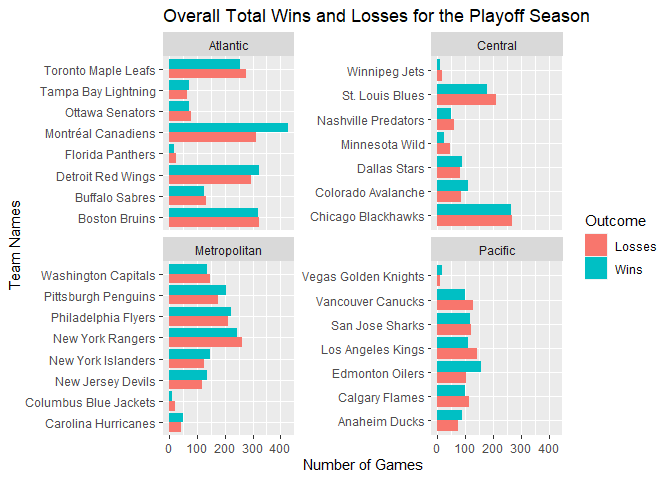

Project 1
================
Lauren Witek
6/12/2020

  - [Introduction to JSON data](#introduction-to-json-data)
      - [What is JSON?](#what-is-json)
      - [Where does JSON get used? Why is it a good way to store
        data?](#where-does-json-get-used-why-is-it-a-good-way-to-store-data)
      - [Packages/Functions available for reading JSON data into
        R](#packagesfunctions-available-for-reading-json-data-into-r)
      - [References](#references)
  - [Data: National Hockey League (NHL)
    API](#data-national-hockey-league-nhl-api)
      - [Exploratory Analysis](#exploratory-analysis)

# Introduction to JSON data

## What is JSON?

JSON (JavaScript Object Notation) is a open standard file format and a
data-interchange format that was derived from JavaScript and is easy to
read and
write.<sup>[1](https://www.json.org/json-en.htmlhttps://www.json.org/json-en.html)</sup>
It uses readable text to store and transmit data
objects.<sup>[2](https://en.wikipedia.org/wiki/JSON)</sup> JSON uses
conventions that are familiar to programmers of the C-family (ex. C,
C++, C\#, Java, etc) but is completely language
dependent.<sup>[1](https://www.json.org/json-en.htmlhttps://www.json.org/json-en.html)</sup>

JSON is built on two
structures<sup>[1](https://www.json.org/json-en.htmlhttps://www.json.org/json-en.html)</sup>

1.  *object* - A collection of name/value pairs
2.  *array* - An ordered list of values

JSON Structure<sup>[3](http://secretgeek.net/json_3mins)</sup>

1.  An *object* is contained in a squiggly bracket (**{}**)
2.  An *array* is surrounded by a square bracket (**\[\]**)
3.  *Names* (with double quptes) and *values* are separated by a colon
    (**:**)
      - A *value* can be a *string* with double quotes, a *number*, a
        *Boolean*, null, an *object* or an *array*
4.  *Array* elements are separated by commas (**,**)

Here is a small sample of
JSON:<sup>[4](https://developer.mozilla.org/en-US/docs/Learn/JavaScript/Objects/JSON)</sup>

``` r
{
  "squadName": "Super hero squad",
  "homeTown": "Metro City",
  "formed": 2016,
  "secretBase": "Super tower",
  "active": true,
  "members": [
    {
      "name": "Molecule Man",
      "age": 29,
      "secretIdentity": "Dan Jukes",
      "powers": [
        "Radiation resistance",
        "Turning tiny",
        "Radiation blast"
      ]
    },
    {
      "name": "Madame Uppercut",
      "age": 39,
      "secretIdentity": "Jane Wilson",
      "powers": [
        "Million tonne punch",
        "Damage resistance",
        "Superhuman reflexes"
      ]
    },
    {
      "name": "Eternal Flame",
      "age": 1000000,
      "secretIdentity": "Unknown",
      "powers": [
        "Immortality",
        "Heat Immunity",
        "Inferno",
        "Teleportation",
        "Interdimensional travel"
      ]
    }
  ]
}
```

## Where does JSON get used? Why is it a good way to store data?

JSON is commonly used in web applications for transmitting data due to
its text only format. For example, sending some data from the server to
the client, so that it can be displayed on the webpage. It has also
become a popular format for database migration from modern apps over to
SQL
databases.<sup>[5](https://blog.sqlizer.io/posts/json-store-data/#:~:text=It%20all%20depends%20on%20what%20you%20need%20to%20do&text=Stored%20JSON%20data%20must%20be,a%20bonus%20for%20database%20migration.)</sup>

JSON is perfect for storing temporary data without the need for
reporting. JSON provides a high level of interoperability since it can
be used as a data format for any programming language. Stored JSON data
*must* be text which allows them to be easily sent between
servers.<sup>[5](https://blog.sqlizer.io/posts/json-store-data/#:~:text=It%20all%20depends%20on%20what%20you%20need%20to%20do&text=Stored%20JSON%20data%20must%20be,a%20bonus%20for%20database%20migration.)</sup>

## Packages/Functions available for reading JSON data into R

There are three major packages for JSON Data

1.  `jsonlite`
2.  `rjson`
3.  `RJSONIO`

I have chosen to use `jsonlite` when pulling in JSON data. `jsonlite`
can be combined with `dplyr` to work with JSON data easier and faster in
R. Its main strength is that it can convert between R objects and JSON
without loss of type or information. It is also ideal for interacting
with web APIs which will be demonstrated
below.<sup>[6](https://cran.r-project.org/web/packages/jsonlite/vignettes/json-aaquickstart.html)</sup>

## References

Information was procured from each of the following sites:

1.  [Introducting JSON](https://www.json.org/json-en.html)
2.  [JSON](https://en.wikipedia.org/wiki/JSON)
3.  [What is JSON: the 3 minute JSON
    Tutorial](http://secretgeek.net/json_3mins)
4.  [Working with
    JSON](https://developer.mozilla.org/en-US/docs/Learn/JavaScript/Objects/JSON)
5.  [When should you store data as a JSON
    string?](https://blog.sqlizer.io/posts/json-store-data/#:~:text=It%20all%20depends%20on%20what%20you%20need%20to%20do&text=Stored%20JSON%20data%20must%20be,a%20bonus%20for%20database%20migration.)
6.  [Getting started with JSON and
    jsonlite](https://cran.r-project.org/web/packages/jsonlite/vignettes/json-aaquickstart.html)

# Data: National Hockey League (NHL) API

Exploring the dataset from the National Hockey League by reading the
JSON file pulled from the [NHL API](https://records.nhl.com/site/api)

This below function contacts the NHL records ‘Franchise’ API and returns
well-formated, parsed data.

Returns Id, First Season ID, Last Season ID and Every team in the
history of the NHL

``` r
nhl("/franchise")
```

    ## # A tibble: 38 x 6
    ##       ID `First Season` `Last Season` `Team ID` `Team Name` `Team Location`
    ##    <int>          <int>         <int>     <int> <chr>       <chr>          
    ##  1     1       19171918            NA         8 Canadiens   Montréal       
    ##  2     2       19171918      19171918        41 Wanderers   Montreal       
    ##  3     3       19171918      19341935        45 Eagles      St. Louis      
    ##  4     4       19191920      19241925        37 Tigers      Hamilton       
    ##  5     5       19171918            NA        10 Maple Leafs Toronto        
    ##  6     6       19241925            NA         6 Bruins      Boston         
    ##  7     7       19241925      19371938        43 Maroons     Montreal       
    ##  8     8       19251926      19411942        51 Americans   Brooklyn       
    ##  9     9       19251926      19301931        39 Quakers     Philadelphia   
    ## 10    10       19261927            NA         3 Rangers     New York       
    ## # ... with 28 more rows

Returns Total stats fro every Franchise

``` r
nhl("/franchise-team-totals")
```

    ## # A tibble: 104 x 30
    ##       ID `Active Franchi~ `First Season` `Franchise ID` `Game Type`
    ##    <int>            <int>          <int>          <int>       <int>
    ##  1     1                1       19821983             23           2
    ##  2     2                1       19821983             23           3
    ##  3     3                1       19721973             22           2
    ##  4     4                1       19721973             22           3
    ##  5     5                1       19261927             10           2
    ##  6     6                1       19261927             10           3
    ##  7     7                1       19671968             16           3
    ##  8     8                1       19671968             16           2
    ##  9     9                1       19671968             17           2
    ## 10    10                1       19671968             17           3
    ## # ... with 94 more rows, and 25 more variables: `Games Played` <int>, `Goals
    ## #   Against` <int>, `Goals For` <int>, `Home Losses` <int>, `Home Overtime
    ## #   Losses` <int>, `Home Ties` <int>, `Home Wins` <int>, `Last Season` <int>,
    ## #   Losses <int>, `Overtime Losses` <int>, `Penalty Minutes` <int>, `Points
    ## #   Percent per Game` <dbl>, Points <int>, `Road Losses` <int>, `Road Overtime
    ## #   Losses` <int>, `Road Ties` <int>, `Road Wins` <int>, `Shootout
    ## #   Losses` <int>, `Shootout Wins` <int>, Shutouts <int>, `Team ID` <int>,
    ## #   `Team Name` <chr>, Ties <int>, `Tri-Code` <chr>, Wins <int>

Drill-down into season records for for a specific Franchise. Change
which Franchise is specified by changing the Franchise ID. This is the
same for the two following two calls. Here I have specified the Columbus
Blue Jackets (also the team called in the below two examples).

``` r
nhl("/franchise-season-records?cayenneExp=franchiseId=ID", 36)
```

    ## # A tibble: 1 x 57
    ##      ID `Fewest Goals` `Fewest Goals A~ `Fewest Goals A~ `Fewest Goals S~
    ##   <int>          <int>            <int> <chr>            <chr>           
    ## 1    29            164              187 2019-20 (82)     2001-02 (82)    
    ## # ... with 52 more variables: `Fewest Losses` <int>, `Fewest Losses
    ## #   Seasons` <chr>, `Fewest Points` <int>, `Fewest Points Seasons` <chr>,
    ## #   `Fewest Ties` <int>, `Fewest Ties Seasons` <chr>, `Fewest Wins` <int>,
    ## #   `Fewest Wins Seasons` <chr>, `Franchise ID` <int>, `Franchise Name` <chr>,
    ## #   `Home Loss Streak` <int>, `Home Loss Streak Dates` <chr>, `Home Point
    ## #   Streak` <int>, `Home Point Streak Dates` <chr>, `Home Win Streak` <int>,
    ## #   `Home Win Streak Dates` <chr>, `Home Winless Streak` <int>, `Home Winless
    ## #   Streak Dates` <chr>, `Loss Streak` <int>, `Loss Streak Dates` <chr>, `Most
    ## #   Game Goals` <int>, `Most Game Goals Dates` <chr>, `Most Goals` <int>, `Most
    ## #   Goals Against` <int>, `Most Goals Against Seasons` <chr>, `Most Goals
    ## #   Seasons` <chr>, `Most Losses` <int>, `Most Losses Seasons` <chr>, `Most
    ## #   Penalty Minutes` <int>, `Most Penalty Minutes Seasons` <chr>, `Most
    ## #   Points` <int>, `Most Points Seasons` <chr>, `Most Shutouts` <int>, `Most
    ## #   Shutouts Seasons` <chr>, `Most Ties` <int>, `Most Ties Seasons` <chr>,
    ## #   `Most Wins` <int>, `Most Wins Seasons` <chr>, `Point Streak` <int>, `Point
    ## #   Streak Dates` <chr>, `Road Loss Streak` <int>, `Road Loss Streak
    ## #   Dates` <chr>, `Road Point Streak` <int>, `Road Point Streak Dates` <chr>,
    ## #   `Road Win Streak` <int>, `Road Win Streak Dates` <chr>, `Road Winless
    ## #   Streak` <int>, `Road Winless Streak Dates` <chr>, `Win Streak` <int>, `win
    ## #   Streak Dates` <chr>, `Winless Streak` <int>, `Winless Streak Dates` <chr>

Goalie records for the specific Franchise.

``` r
nhl("/franchise-goalie-records?cayenneExp=franchiseId=ID", 36)
```

    ##      ID Active Player    First Name Franchise ID        Franchise Name
    ## 1   284          TRUE        Sergei           36 Columbus Blue Jackets
    ## 2   301         FALSE          Marc           36 Columbus Blue Jackets
    ## 3   323         FALSE         Steve           36 Columbus Blue Jackets
    ## 4   730         FALSE           Ron           36 Columbus Blue Jackets
    ## 5   849         FALSE Jean-Francois           36 Columbus Blue Jackets
    ## 6   852         FALSE          Fred           36 Columbus Blue Jackets
    ## 7   923         FALSE         Brian           36 Columbus Blue Jackets
    ## 8   946         FALSE       Mathieu           36 Columbus Blue Jackets
    ## 9   991         FALSE        Martin           36 Columbus Blue Jackets
    ## 10  996         FALSE        Curtis           36 Columbus Blue Jackets
    ## 11 1015         FALSE            Ty           36 Columbus Blue Jackets
    ## 12 1045         FALSE       Fredrik           36 Columbus Blue Jackets
    ## 13 1049         FALSE          Mike           36 Columbus Blue Jackets
    ## 14 1054          TRUE        Curtis           36 Columbus Blue Jackets
    ## 15 1055         FALSE         David           36 Columbus Blue Jackets
    ## 16 1056         FALSE          Wade           36 Columbus Blue Jackets
    ##    Game Type Games Played   Last Name Losses           Most Goals Against Dates
    ## 1          2          374   Bobrovsky    130             2018-12-04, 2018-10-13
    ## 2          2          266       Denis    146                         2002-02-04
    ## 3          2          232       Mason     99                         2009-11-11
    ## 4          2           97     Tugnutt     52             2002-03-30, 2001-10-23
    ## 5          2           14       Labbe      5                         2003-02-21
    ## 6          2           21  Brathwaite     11                         2004-01-22
    ## 7          2            3     Boucher      1 2007-03-30, 2007-03-17, 2007-03-03
    ## 8          2           71       Garon     23                         2010-12-23
    ## 9          2            9      Prusek      3                         2005-11-18
    ## 10         2           36     Sanford     18                         2011-12-22
    ## 11         2           11     Conklin      3             2007-02-02, 2007-01-31
    ## 12         2          100     Norrena     45 2008-02-13, 2008-01-08, 2006-12-28
    ## 13         2            4     McKenna      1                         2013-12-14
    ## 14         2           85  McElhinney     33             2016-03-05, 2014-01-04
    ## 15         2            1     Leneveu      0                         2011-04-03
    ## 16         2            3 Dubielewicz      2                         2009-01-31
    ##    Most Goals Against One Game                   Most Saves Dates
    ## 1                            8                         2014-12-04
    ## 2                            8                         2004-02-14
    ## 3                            8             2010-11-19, 2008-12-17
    ## 4                            7                         2000-10-31
    ## 5                            6                         2002-03-11
    ## 6                            7                         2004-03-26
    ## 7                            3                         2007-03-03
    ## 8                            6 2010-03-09, 2009-12-10, 2009-10-10
    ## 9                            6                         2005-11-26
    ## 10                           6                         2011-12-15
    ## 11                           5                         2007-01-30
    ## 12                           6                         2008-03-16
    ## 13                           4                         2013-12-23
    ## 14                           6                         2015-04-11
    ## 15                           2                         2011-04-03
    ## 16                           4                         2009-03-13
    ##    Most Saves One Game Most Shots Against Dates Most Shots Against One Game
    ## 1                   52               2014-12-04                          55
    ## 2                   48               2002-11-12                          51
    ## 3                   47               2010-11-19                          50
    ## 4                   45               2000-10-31                          46
    ## 5                   34               2003-02-21                          37
    ## 6                   43               2004-03-26                          44
    ## 7                   32               2007-03-03                          35
    ## 8                   36               2009-12-10                          39
    ## 9                   31               2005-11-26                          34
    ## 10                  39               2011-12-15                          41
    ## 11                  35   2007-01-31, 2007-01-30                          37
    ## 12                  43               2008-03-16                          46
    ## 13                  30               2013-12-23                          33
    ## 14                  48               2015-04-11                          52
    ## 15                  10               2011-04-03                          12
    ## 16                  27               2009-03-13                          30
    ##    Most Shutouts One Season     Most Shutouts Season IDs Most Wins One Season
    ## 1                         9                     20182019                   41
    ## 2                         5           20022003, 20032004                   27
    ## 3                        10                     20082009                   33
    ## 4                         4                     20002001                   22
    ## 5                         0 20002001, 20012002, 20022003                    2
    ## 6                         0                     20032004                    4
    ## 7                         0                     20062007                    1
    ## 8                         3                     20102011                   12
    ## 9                         0                     20052006                    3
    ## 10                        1                     20112012                   10
    ## 11                        0                     20062007                    2
    ## 12                        3                     20062007                   24
    ## 13                        0                     20132014                    1
    ## 14                        2                     20132014                   12
    ## 15                        0                     20102011                    0
    ## 16                        0                     20082009                    1
    ##    Most Wins Season IDs Overtime Losses Player ID Position Code
    ## 1              20162017              27   8475683             G
    ## 2              20022003               1   8462055             G
    ## 3              20082009              27   8473461             G
    ## 4              20002001              NA   8451837             G
    ## 5              20022003              NA   8459239             G
    ## 6              20032004              NA   8459252             G
    ## 7              20062007               0   8462052             G
    ## 8              20092010              12   8464999             G
    ## 9              20052006               0   8468037             G
    ## 10             20112012               4   8468166             G
    ## 11             20062007               2   8469152             G
    ## 12             20062007              11   8470090             G
    ## 13             20132014               1   8470093             G
    ## 14             20142015               8   8470147             G
    ## 15             20102011               0   8470263             G
    ## 16             20082009               0   8470584             G
    ##    Rookie Games Played Rookie Shutouts Rookie Wins Seasons Shutouts Ties Wins
    ## 1                   NA              NA          NA       7       33    0  213
    ## 2                   32               0           6       5       12   24   84
    ## 3                   61              10          33       5       19   NA   96
    ## 4                   NA              NA          NA       2        6    8   34
    ## 5                   NA              NA          NA       3        0    0    3
    ## 6                   NA              NA          NA       1        0    1    4
    ## 7                   NA              NA          NA       1        0   NA    1
    ## 8                   NA              NA          NA       2        5   NA   22
    ## 9                   NA              NA          NA       1        0   NA    3
    ## 10                  NA              NA          NA       1        1   NA   10
    ## 11                  NA              NA          NA       1        0   NA    2
    ## 12                  NA              NA          NA       3        5   NA   35
    ## 13                  NA              NA          NA       1        0   NA    1
    ## 14                  NA              NA          NA       4        2   NA   26
    ## 15                  NA              NA          NA       1        0   NA    0
    ## 16                  NA              NA          NA       1        0   NA    1

Skater records for the specified Franchise.

``` r
nhl("/franchise-skater-records?cayenneExp=franchiseId=ID", 36)
```

    ## # A tibble: 264 x 30
    ##       ID `Active Player` Assists `First Name` `Franchise ID` `Franchise Name`
    ##    <int> <lgl>             <int> <chr>                 <int> <chr>           
    ##  1 16944 FALSE                92 Rostislav                36 Columbus Blue J~
    ##  2 16981 FALSE               258 Rick                     36 Columbus Blue J~
    ##  3 17043 FALSE                35 Jared                    36 Columbus Blue J~
    ##  4 17088 TRUE                114 Artemi                   36 Columbus Blue J~
    ##  5 17119 FALSE                18 Jody                     36 Columbus Blue J~
    ##  6 17143 TRUE                114 Ryan                     36 Columbus Blue J~
    ##  7 17154 FALSE               204 David                    36 Columbus Blue J~
    ##  8 17168 TRUE                150 Seth                     36 Columbus Blue J~
    ##  9 18709 FALSE                68 Andrew                   36 Columbus Blue J~
    ## 10 19206 FALSE                15 Kevin                    36 Columbus Blue J~
    ## # ... with 254 more rows, and 24 more variables: `Game Type` <int>, `Games
    ## #   Played` <int>, Goals <int>, `Last Name` <chr>, `Most Assists Game
    ## #   Dates` <chr>, ` Most Assists One Game` <int>, `Most Assists One
    ## #   Season` <int>, `Most Assists Season IDs` <chr>, `Most Goals Game
    ## #   Dates` <chr>, `Most Goals One Game` <int>, `Most Goals One Season` <int>,
    ## #   `Most Goals Season IDs` <chr>, `Most Penalty Minutes One Season` <int>,
    ## #   `Most Penalty Minutes Season IDs` <chr>, `Most Points Game Dates` <chr>,
    ## #   `Most Points One Game` <int>, `Most Points One Season` <int>, `Most Points
    ## #   Season IDs` <chr>, `Penalty Minutes` <int>, `Player ID` <int>,
    ## #   Points <int>, `Position Code` <chr>, `Rookie Points` <int>, Seasons <int>

## Exploratory Analysis

Adding two new variables(Division and Conference) to the `fran` data
table and outputting a new data table call `div_conf`

``` r
div_conf <- fran %>% filter(is.na(lastSeasonId)) %>% 
                  mutate(Division = ifelse(teamPlaceName %in% c("Washington", "Philadelphia", "Pittsburgh", "Carolina", "Columbus", 
                                                                "New York", "New Jersey"), "Metropolitan",
                                    ifelse(teamPlaceName %in% c("Boston", "Tampa Bay", "Toronto", "Florida", "Montréal", "Buffalo", 
                                                                "Ottawa", "Detroit"), "Atlantic",
                                    ifelse(teamPlaceName %in% c("St. Louis", "Colorado", "Dallas", "Winnipeg", "Nashville", "Minnesota",
                                                                "Chicago"), "Central", 
                                    ifelse(teamPlaceName %in% c("Vegas", "Edmonton", "Calgary", "Vancouver", "Arizona", "Anaheim", 
                                                                "Los Angeles", "San Jose"), "Pacific", "Div"))))) %>% 
                  mutate(Conference = ifelse(Division %in% c("Metropolitan", "Atlantic"), "Eastern",
                                    ifelse(Division %in% c("Central", "Pacific"), "Western", "Conf"))) %>% 
                  select(teamCommonName, teamPlaceName, Division, Conference) %>% 
                  unite(teamName, teamPlaceName, teamCommonName, sep = " ")
div_conf
```

    ## # A tibble: 31 x 3
    ##    teamName            Division     Conference
    ##    <chr>               <chr>        <chr>     
    ##  1 Montréal Canadiens  Atlantic     Eastern   
    ##  2 Toronto Maple Leafs Atlantic     Eastern   
    ##  3 Boston Bruins       Atlantic     Eastern   
    ##  4 New York Rangers    Metropolitan Eastern   
    ##  5 Chicago Blackhawks  Central      Western   
    ##  6 Detroit Red Wings   Atlantic     Eastern   
    ##  7 Los Angeles Kings   Pacific      Western   
    ##  8 Dallas Stars        Central      Western   
    ##  9 Philadelphia Flyers Metropolitan Eastern   
    ## 10 Pittsburgh Penguins Metropolitan Eastern   
    ## # ... with 21 more rows

Combining the `div_conf` and the `rec_total_team` data.

``` r
total_teams <- full_join(div_conf, rec_team_total, by = "teamName")

total_teams <- total_teams %>% select(id, teamName, everything()) %>% filter(is.na(lastSeasonId), gameTypeId == 2) %>% arrange(id)

total_teams
```

    ## # A tibble: 31 x 32
    ##       id teamName Division Conference activeFranchise firstSeasonId franchiseId
    ##    <int> <chr>    <chr>    <chr>                <int>         <int>       <int>
    ##  1     1 New Jer~ Metropo~ Eastern                  1      19821983          23
    ##  2     3 New Yor~ Metropo~ Eastern                  1      19721973          22
    ##  3     5 New Yor~ Metropo~ Eastern                  1      19261927          10
    ##  4     8 Philade~ Metropo~ Eastern                  1      19671968          16
    ##  5     9 Pittsbu~ Metropo~ Eastern                  1      19671968          17
    ##  6    11 Boston ~ Atlantic Eastern                  1      19241925           6
    ##  7    13 Buffalo~ Atlantic Eastern                  1      19701971          19
    ##  8    16 Montréa~ Atlantic Eastern                  1      19171918           1
    ##  9    17 Ottawa ~ Atlantic Eastern                  1      19921993          30
    ## 10    19 Toronto~ Atlantic Eastern                  1      19271928           5
    ## # ... with 21 more rows, and 25 more variables: gameTypeId <int>,
    ## #   gamesPlayed <int>, goalsAgainst <int>, goalsFor <int>, homeLosses <int>,
    ## #   homeOvertimeLosses <int>, homeTies <int>, homeWins <int>,
    ## #   lastSeasonId <int>, losses <int>, overtimeLosses <int>,
    ## #   penaltyMinutes <int>, pointPctg <dbl>, points <int>, roadLosses <int>,
    ## #   roadOvertimeLosses <int>, roadTies <int>, roadWins <int>,
    ## #   shootoutLosses <int>, shootoutWins <int>, shutouts <int>, teamId <int>,
    ## #   ties <int>, triCode <chr>, wins <int>

``` r
names(total_teams)
```

    ##  [1] "id"                 "teamName"           "Division"          
    ##  [4] "Conference"         "activeFranchise"    "firstSeasonId"     
    ##  [7] "franchiseId"        "gameTypeId"         "gamesPlayed"       
    ## [10] "goalsAgainst"       "goalsFor"           "homeLosses"        
    ## [13] "homeOvertimeLosses" "homeTies"           "homeWins"          
    ## [16] "lastSeasonId"       "losses"             "overtimeLosses"    
    ## [19] "penaltyMinutes"     "pointPctg"          "points"            
    ## [22] "roadLosses"         "roadOvertimeLosses" "roadTies"          
    ## [25] "roadWins"           "shootoutLosses"     "shootoutWins"      
    ## [28] "shutouts"           "teamId"             "ties"              
    ## [31] "triCode"            "wins"

``` r
table_all_wlt <- total_teams %>% filter(gameTypeId == 2) %>% arrange(Conference, Division) %>% select(teamName, Division, Conference, wins, losses, ties) %>% rename("Wins" = wins, "Losses" = losses, "Ties" = ties, "TeamName" = teamName)

kable(table_all_wlt, caption = "Overall Wins, Losses, and Ties for the Regular Season")
```

<table>

<caption>

Overall Wins, Losses, and Ties for the Regular Season

</caption>

<thead>

<tr>

<th style="text-align:left;">

TeamName

</th>

<th style="text-align:left;">

Division

</th>

<th style="text-align:left;">

Conference

</th>

<th style="text-align:right;">

Wins

</th>

<th style="text-align:right;">

Losses

</th>

<th style="text-align:right;">

Ties

</th>

</tr>

</thead>

<tbody>

<tr>

<td style="text-align:left;">

Boston Bruins

</td>

<td style="text-align:left;">

Atlantic

</td>

<td style="text-align:left;">

Eastern

</td>

<td style="text-align:right;">

3208

</td>

<td style="text-align:right;">

2387

</td>

<td style="text-align:right;">

791

</td>

</tr>

<tr>

<td style="text-align:left;">

Buffalo Sabres

</td>

<td style="text-align:left;">

Atlantic

</td>

<td style="text-align:left;">

Eastern

</td>

<td style="text-align:right;">

1790

</td>

<td style="text-align:right;">

1530

</td>

<td style="text-align:right;">

409

</td>

</tr>

<tr>

<td style="text-align:left;">

Montréal Canadiens

</td>

<td style="text-align:left;">

Atlantic

</td>

<td style="text-align:left;">

Eastern

</td>

<td style="text-align:right;">

3449

</td>

<td style="text-align:right;">

2281

</td>

<td style="text-align:right;">

837

</td>

</tr>

<tr>

<td style="text-align:left;">

Ottawa Senators

</td>

<td style="text-align:left;">

Atlantic

</td>

<td style="text-align:left;">

Eastern

</td>

<td style="text-align:right;">

948

</td>

<td style="text-align:right;">

912

</td>

<td style="text-align:right;">

115

</td>

</tr>

<tr>

<td style="text-align:left;">

Toronto Maple Leafs

</td>

<td style="text-align:left;">

Atlantic

</td>

<td style="text-align:left;">

Eastern

</td>

<td style="text-align:right;">

2838

</td>

<td style="text-align:right;">

2682

</td>

<td style="text-align:right;">

773

</td>

</tr>

<tr>

<td style="text-align:left;">

Florida Panthers

</td>

<td style="text-align:left;">

Atlantic

</td>

<td style="text-align:left;">

Eastern

</td>

<td style="text-align:right;">

852

</td>

<td style="text-align:right;">

856

</td>

<td style="text-align:right;">

142

</td>

</tr>

<tr>

<td style="text-align:left;">

Tampa Bay Lightning

</td>

<td style="text-align:left;">

Atlantic

</td>

<td style="text-align:left;">

Eastern

</td>

<td style="text-align:right;">

949

</td>

<td style="text-align:right;">

930

</td>

<td style="text-align:right;">

112

</td>

</tr>

<tr>

<td style="text-align:left;">

Detroit Red Wings

</td>

<td style="text-align:left;">

Atlantic

</td>

<td style="text-align:left;">

Eastern

</td>

<td style="text-align:right;">

2872

</td>

<td style="text-align:right;">

2419

</td>

<td style="text-align:right;">

773

</td>

</tr>

<tr>

<td style="text-align:left;">

New Jersey Devils

</td>

<td style="text-align:left;">

Metropolitan

</td>

<td style="text-align:left;">

Eastern

</td>

<td style="text-align:right;">

1375

</td>

<td style="text-align:right;">

1181

</td>

<td style="text-align:right;">

219

</td>

</tr>

<tr>

<td style="text-align:left;">

New York Islanders

</td>

<td style="text-align:left;">

Metropolitan

</td>

<td style="text-align:left;">

Eastern

</td>

<td style="text-align:right;">

1656

</td>

<td style="text-align:right;">

1570

</td>

<td style="text-align:right;">

347

</td>

</tr>

<tr>

<td style="text-align:left;">

New York Rangers

</td>

<td style="text-align:left;">

Metropolitan

</td>

<td style="text-align:left;">

Eastern

</td>

<td style="text-align:right;">

2856

</td>

<td style="text-align:right;">

2693

</td>

<td style="text-align:right;">

808

</td>

</tr>

<tr>

<td style="text-align:left;">

Philadelphia Flyers

</td>

<td style="text-align:left;">

Metropolitan

</td>

<td style="text-align:left;">

Eastern

</td>

<td style="text-align:right;">

2054

</td>

<td style="text-align:right;">

1429

</td>

<td style="text-align:right;">

457

</td>

</tr>

<tr>

<td style="text-align:left;">

Pittsburgh Penguins

</td>

<td style="text-align:left;">

Metropolitan

</td>

<td style="text-align:left;">

Eastern

</td>

<td style="text-align:right;">

1866

</td>

<td style="text-align:right;">

1718

</td>

<td style="text-align:right;">

383

</td>

</tr>

<tr>

<td style="text-align:left;">

Carolina Hurricanes

</td>

<td style="text-align:left;">

Metropolitan

</td>

<td style="text-align:left;">

Eastern

</td>

<td style="text-align:right;">

791

</td>

<td style="text-align:right;">

713

</td>

<td style="text-align:right;">

86

</td>

</tr>

<tr>

<td style="text-align:left;">

Washington Capitals

</td>

<td style="text-align:left;">

Metropolitan

</td>

<td style="text-align:left;">

Eastern

</td>

<td style="text-align:right;">

1664

</td>

<td style="text-align:right;">

1452

</td>

<td style="text-align:right;">

303

</td>

</tr>

<tr>

<td style="text-align:left;">

Columbus Blue Jackets

</td>

<td style="text-align:left;">

Metropolitan

</td>

<td style="text-align:left;">

Eastern

</td>

<td style="text-align:right;">

660

</td>

<td style="text-align:right;">

672

</td>

<td style="text-align:right;">

33

</td>

</tr>

<tr>

<td style="text-align:left;">

Chicago Blackhawks

</td>

<td style="text-align:left;">

Central

</td>

<td style="text-align:left;">

Western

</td>

<td style="text-align:right;">

2788

</td>

<td style="text-align:right;">

2736

</td>

<td style="text-align:right;">

814

</td>

</tr>

<tr>

<td style="text-align:left;">

Nashville Predators

</td>

<td style="text-align:left;">

Central

</td>

<td style="text-align:left;">

Western

</td>

<td style="text-align:right;">

821

</td>

<td style="text-align:right;">

633

</td>

<td style="text-align:right;">

60

</td>

</tr>

<tr>

<td style="text-align:left;">

St. Louis Blues

</td>

<td style="text-align:left;">

Central

</td>

<td style="text-align:left;">

Western

</td>

<td style="text-align:right;">

1902

</td>

<td style="text-align:right;">

1625

</td>

<td style="text-align:right;">

432

</td>

</tr>

<tr>

<td style="text-align:left;">

Colorado Avalanche

</td>

<td style="text-align:left;">

Central

</td>

<td style="text-align:left;">

Western

</td>

<td style="text-align:right;">

968

</td>

<td style="text-align:right;">

715

</td>

<td style="text-align:right;">

101

</td>

</tr>

<tr>

<td style="text-align:left;">

Dallas Stars

</td>

<td style="text-align:left;">

Central

</td>

<td style="text-align:left;">

Western

</td>

<td style="text-align:right;">

1061

</td>

<td style="text-align:right;">

719

</td>

<td style="text-align:right;">

125

</td>

</tr>

<tr>

<td style="text-align:left;">

Minnesota Wild

</td>

<td style="text-align:left;">

Central

</td>

<td style="text-align:left;">

Western

</td>

<td style="text-align:right;">

724

</td>

<td style="text-align:right;">

583

</td>

<td style="text-align:right;">

55

</td>

</tr>

<tr>

<td style="text-align:left;">

Winnipeg Jets

</td>

<td style="text-align:left;">

Central

</td>

<td style="text-align:left;">

Western

</td>

<td style="text-align:right;">

352

</td>

<td style="text-align:right;">

269

</td>

<td style="text-align:right;">

NA

</td>

</tr>

<tr>

<td style="text-align:left;">

Calgary Flames

</td>

<td style="text-align:left;">

Pacific

</td>

<td style="text-align:left;">

Western

</td>

<td style="text-align:right;">

1471

</td>

<td style="text-align:right;">

1209

</td>

<td style="text-align:right;">

271

</td>

</tr>

<tr>

<td style="text-align:left;">

Edmonton Oilers

</td>

<td style="text-align:left;">

Pacific

</td>

<td style="text-align:left;">

Western

</td>

<td style="text-align:right;">

1434

</td>

<td style="text-align:right;">

1318

</td>

<td style="text-align:right;">

262

</td>

</tr>

<tr>

<td style="text-align:left;">

Vancouver Canucks

</td>

<td style="text-align:left;">

Pacific

</td>

<td style="text-align:left;">

Western

</td>

<td style="text-align:right;">

1626

</td>

<td style="text-align:right;">

1717

</td>

<td style="text-align:right;">

391

</td>

</tr>

<tr>

<td style="text-align:left;">

Anaheim Ducks

</td>

<td style="text-align:left;">

Pacific

</td>

<td style="text-align:left;">

Western

</td>

<td style="text-align:right;">

973

</td>

<td style="text-align:right;">

804

</td>

<td style="text-align:right;">

107

</td>

</tr>

<tr>

<td style="text-align:left;">

Los Angeles Kings

</td>

<td style="text-align:left;">

Pacific

</td>

<td style="text-align:left;">

Western

</td>

<td style="text-align:right;">

1733

</td>

<td style="text-align:right;">

1801

</td>

<td style="text-align:right;">

424

</td>

</tr>

<tr>

<td style="text-align:left;">

San Jose Sharks

</td>

<td style="text-align:left;">

Pacific

</td>

<td style="text-align:left;">

Western

</td>

<td style="text-align:right;">

1049

</td>

<td style="text-align:right;">

892

</td>

<td style="text-align:right;">

121

</td>

</tr>

<tr>

<td style="text-align:left;">

Arizona Coyotes

</td>

<td style="text-align:left;">

Pacific

</td>

<td style="text-align:left;">

Western

</td>

<td style="text-align:right;">

190

</td>

<td style="text-align:right;">

236

</td>

<td style="text-align:right;">

NA

</td>

</tr>

<tr>

<td style="text-align:left;">

Vegas Golden Knights

</td>

<td style="text-align:left;">

Pacific

</td>

<td style="text-align:left;">

Western

</td>

<td style="text-align:right;">

133

</td>

<td style="text-align:right;">

80

</td>

<td style="text-align:right;">

NA

</td>

</tr>

</tbody>

</table>

``` r
table_all_wlt <- table_all_wlt %>% gather(Outcome, Amount, 4:6)

table_div_wlt <- total_teams %>% filter(gameTypeId == 2) %>%  group_by(Division, Conference) %>% summarise(wins = sum(wins), losses = sum(losses), ties = sum(ties, na.rm = TRUE)) %>% rename("Wins" = wins, "Losses" = losses, "Ties" = ties)

kable(table_div_wlt, caption = "Overall Wins, Losses, and Ties for the Regular Season by Division")
```

<table>

<caption>

Overall Wins, Losses, and Ties for the Regular Season by Division

</caption>

<thead>

<tr>

<th style="text-align:left;">

Division

</th>

<th style="text-align:left;">

Conference

</th>

<th style="text-align:right;">

Wins

</th>

<th style="text-align:right;">

Losses

</th>

<th style="text-align:right;">

Ties

</th>

</tr>

</thead>

<tbody>

<tr>

<td style="text-align:left;">

Atlantic

</td>

<td style="text-align:left;">

Eastern

</td>

<td style="text-align:right;">

16906

</td>

<td style="text-align:right;">

13997

</td>

<td style="text-align:right;">

3952

</td>

</tr>

<tr>

<td style="text-align:left;">

Central

</td>

<td style="text-align:left;">

Western

</td>

<td style="text-align:right;">

8616

</td>

<td style="text-align:right;">

7280

</td>

<td style="text-align:right;">

1587

</td>

</tr>

<tr>

<td style="text-align:left;">

Metropolitan

</td>

<td style="text-align:left;">

Eastern

</td>

<td style="text-align:right;">

12922

</td>

<td style="text-align:right;">

11428

</td>

<td style="text-align:right;">

2636

</td>

</tr>

<tr>

<td style="text-align:left;">

Pacific

</td>

<td style="text-align:left;">

Western

</td>

<td style="text-align:right;">

8609

</td>

<td style="text-align:right;">

8057

</td>

<td style="text-align:right;">

1576

</td>

</tr>

</tbody>

</table>

``` r
table_conf_wlt <- table_div_wlt %>% group_by(Conference) %>% summarise(Wins = sum(Wins), Losses = sum(Losses), Ties = sum(Ties))

kable(table_conf_wlt, caption = "Overall Wins, Losses, and Ties for the Regular Season by Conference")
```

<table>

<caption>

Overall Wins, Losses, and Ties for the Regular Season by Conference

</caption>

<thead>

<tr>

<th style="text-align:left;">

Conference

</th>

<th style="text-align:right;">

Wins

</th>

<th style="text-align:right;">

Losses

</th>

<th style="text-align:right;">

Ties

</th>

</tr>

</thead>

<tbody>

<tr>

<td style="text-align:left;">

Eastern

</td>

<td style="text-align:right;">

29828

</td>

<td style="text-align:right;">

25425

</td>

<td style="text-align:right;">

6588

</td>

</tr>

<tr>

<td style="text-align:left;">

Western

</td>

<td style="text-align:right;">

17225

</td>

<td style="text-align:right;">

15337

</td>

<td style="text-align:right;">

3163

</td>

</tr>

</tbody>

</table>

``` r
table_all_wlt %>% 
  ggplot(mapping = aes(TeamName, Amount, fill = Outcome)) +
      geom_bar(stat = "identity", position = "dodge") +
      facet_wrap(~Division, scales = "free") +
      coord_flip() +
      labs(title = "Overall Total Wins, Losses, and Ties for the Regular Season", x = "Team Names", Y = "Number of Games")
```

<!-- -->

``` r
## Box plot for each division with dots on top for each team. Or box plot for 1 division but for wins, losses, and ties with dots on top. 
```

``` r
##Ideas: Home wins vs road wins by division scatter plot with regression line
```
