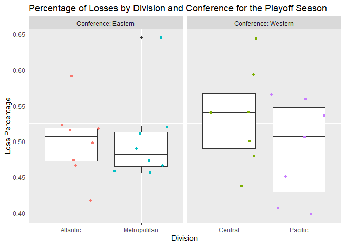
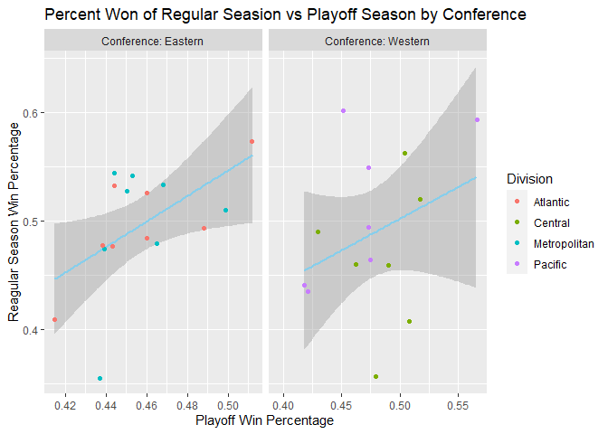

Project 1
================
Lauren Witek
6/12/2020

  - [Introduction to JSON data](#introduction-to-json-data)
      - [What is JSON?](#what-is-json)
      - [Where does JSON get used? Why is it a good way to store
        data?](#where-does-json-get-used-why-is-it-a-good-way-to-store-data)
      - [Packages/Functions available for reading JSON data into
        R](#packagesfunctions-available-for-reading-json-data-into-r)
      - [References](#references)
  - [Data: National Hockey League (NHL)
    API](#data-national-hockey-league-nhl-api)
      - [Exploratory Analysis](#exploratory-analysis)
      - [Creating Three Summary Tables](#creating-three-summary-tables)
      - [Creating a Bar Graph to compare the Overall Percentage Total
        Wins and Losses for the Playoff
        Season](#creating-a-bar-graph-to-compare-the-overall-percentage-total-wins-and-losses-for-the-playoff-season)
      - [Creating Boxplots for the Percentage of Wins and Losses by
        Division and
        Conference](#creating-boxplots-for-the-percentage-of-wins-and-losses-by-division-and-conference)
      - [Creating a Scatterplot with a Linear Model for the Percent of
        Games Won during the Regular Season vs the Playoff
        Season](#creating-a-scatterplot-with-a-linear-model-for-the-percent-of-games-won-during-the-regular-season-vs-the-playoff-season)

# Introduction to JSON data

## What is JSON?

JSON (JavaScript Object Notation) is a open standard file format and a
data-interchange format that was derived from JavaScript and is easy to
read and
write.<sup>[1](https://www.json.org/json-en.htmlhttps://www.json.org/json-en.html)</sup>
It uses readable text to store and transmit data
objects.<sup>[2](https://en.wikipedia.org/wiki/JSON)</sup> JSON uses
conventions that are familiar to programmers of the C-family (ex. C,
C++, C\#, Java, etc) but is completely language
dependent.<sup>[1](https://www.json.org/json-en.htmlhttps://www.json.org/json-en.html)</sup>

JSON is built on two
structures<sup>[1](https://www.json.org/json-en.htmlhttps://www.json.org/json-en.html)</sup>

1.  *object* - A collection of name/value pairs
2.  *array* - An ordered list of values

JSON Structure<sup>[3](http://secretgeek.net/json_3mins)</sup>

1.  An *object* is contained in a squiggly bracket (**{}**)
2.  An *array* is surrounded by a square bracket (**\[\]**)
3.  *Names* (with double quotes) and *values* are separated by a colon
    (**:**)
      - A *value* can be a *string* with double quotes, a *number*, a
        *Boolean*, null, an *object* or an *array*
4.  *Array* elements are separated by commas (**,**)

Here is a small sample of
JSON:<sup>[4](https://developer.mozilla.org/en-US/docs/Learn/JavaScript/Objects/JSON)</sup>

``` r
{
  "squadName": "Super hero squad",
  "homeTown": "Metro City",
  "formed": 2016,
  "secretBase": "Super tower",
  "active": true,
  "members": [
    {
      "name": "Molecule Man",
      "age": 29,
      "secretIdentity": "Dan Jukes",
      "powers": [
        "Radiation resistance",
        "Turning tiny",
        "Radiation blast"
      ]
    },
    {
      "name": "Madame Uppercut",
      "age": 39,
      "secretIdentity": "Jane Wilson",
      "powers": [
        "Million tonne punch",
        "Damage resistance",
        "Superhuman reflexes"
      ]
    },
    {
      "name": "Eternal Flame",
      "age": 1000000,
      "secretIdentity": "Unknown",
      "powers": [
        "Immortality",
        "Heat Immunity",
        "Inferno",
        "Teleportation",
        "Interdimensional travel"
      ]
    }
  ]
}
```

## Where does JSON get used? Why is it a good way to store data?

JSON is commonly used in web applications for transmitting data due to
its text only format. For example, sending some data from the server to
the client, so that it can be displayed on the webpage. It has also
become a popular format for database migration from modern apps over to
SQL
databases.<sup>[5](https://blog.sqlizer.io/posts/json-store-data/#:~:text=It%20all%20depends%20on%20what%20you%20need%20to%20do&text=Stored%20JSON%20data%20must%20be,a%20bonus%20for%20database%20migration.)</sup>

JSON is perfect for storing temporary data without the need for
reporting. JSON provides a high level of interoperability since it can
be used as a data format for any programming language. Stored JSON data
*must* be text which allows them to be easily sent between
servers.<sup>[5](https://blog.sqlizer.io/posts/json-store-data/#:~:text=It%20all%20depends%20on%20what%20you%20need%20to%20do&text=Stored%20JSON%20data%20must%20be,a%20bonus%20for%20database%20migration.)</sup>

## Packages/Functions available for reading JSON data into R

There are three major packages for JSON Data

1.  `jsonlite`
2.  `rjson`
3.  `RJSONIO`

I have chosen to use `jsonlite` when pulling in JSON data. `jsonlite`
can be combined with `dplyr` to work with JSON data easier and faster in
R. Its main strength is that it can convert between R objects and JSON
without loss of type or information. It is also ideal for interacting
with web APIs which will be demonstrated
below.<sup>[6](https://cran.r-project.org/web/packages/jsonlite/vignettes/json-aaquickstart.html)</sup>

## References

Information was procured from each of the following sites:

1.  [Introducting JSON](https://www.json.org/json-en.html)
2.  [JSON](https://en.wikipedia.org/wiki/JSON)
3.  [What is JSON: the 3 minute JSON
    Tutorial](http://secretgeek.net/json_3mins)
4.  [Working with
    JSON](https://developer.mozilla.org/en-US/docs/Learn/JavaScript/Objects/JSON)
5.  [When should you store data as a JSON
    string?](https://blog.sqlizer.io/posts/json-store-data/#:~:text=It%20all%20depends%20on%20what%20you%20need%20to%20do&text=Stored%20JSON%20data%20must%20be,a%20bonus%20for%20database%20migration.)
6.  [Getting started with JSON and
    jsonlite](https://cran.r-project.org/web/packages/jsonlite/vignettes/json-aaquickstart.html)

# Data: National Hockey League (NHL) API

Exploring the dataset from the National Hockey League by reading the
JSON file pulled from the [NHL API](https://records.nhl.com/site/api)

This below function contacts the NHL records ‘Franchise’ API and returns
well-formated, parsed data. It calls the API by useing the `fromJSON`
function under the `jsonlite` package.

“/franchise” call: Returns Id, First Season ID, Last Season ID and Every
team in the history of the NHL

``` r
nhl("/franchise")
```

    ## # A tibble: 38 x 6
    ##       ID `First Season` `Last Season` `Team ID` `Team Name` `Team Location`
    ##    <int>          <int>         <int>     <int> <chr>       <chr>          
    ##  1     1       19171918            NA         8 Canadiens   Montréal       
    ##  2     2       19171918      19171918        41 Wanderers   Montreal       
    ##  3     3       19171918      19341935        45 Eagles      St. Louis      
    ##  4     4       19191920      19241925        37 Tigers      Hamilton       
    ##  5     5       19171918            NA        10 Maple Leafs Toronto        
    ##  6     6       19241925            NA         6 Bruins      Boston         
    ##  7     7       19241925      19371938        43 Maroons     Montreal       
    ##  8     8       19251926      19411942        51 Americans   Brooklyn       
    ##  9     9       19251926      19301931        39 Quakers     Philadelphia   
    ## 10    10       19261927            NA         3 Rangers     New York       
    ## # ... with 28 more rows

“/franchise-team-totals” call: Returns Total stats for every franchise

``` r
nhl("/franchise-team-totals")
```

    ## # A tibble: 104 x 30
    ##       ID `Active Franchi~ `First Season` `Franchise ID` `Game Type`
    ##    <int>            <int>          <int>          <int>       <int>
    ##  1     1                1       19821983             23           2
    ##  2     2                1       19821983             23           3
    ##  3     3                1       19721973             22           2
    ##  4     4                1       19721973             22           3
    ##  5     5                1       19261927             10           2
    ##  6     6                1       19261927             10           3
    ##  7     7                1       19671968             16           3
    ##  8     8                1       19671968             16           2
    ##  9     9                1       19671968             17           2
    ## 10    10                1       19671968             17           3
    ## # ... with 94 more rows, and 25 more variables: `Games Played` <int>, `Goals
    ## #   Against` <int>, `Goals For` <int>, `Home Losses` <int>, `Home Overtime
    ## #   Losses` <int>, `Home Ties` <int>, `Home Wins` <int>, `Last Season` <int>,
    ## #   Losses <int>, `Overtime Losses` <int>, `Penalty Minutes` <int>, `Points
    ## #   Percent per Game` <dbl>, Points <int>, `Road Losses` <int>, `Road Overtime
    ## #   Losses` <int>, `Road Ties` <int>, `Road Wins` <int>, `Shootout
    ## #   Losses` <int>, `Shootout Wins` <int>, Shutouts <int>, `Team ID` <int>,
    ## #   `Team Name` <chr>, Ties <int>, `Tri-Code` <chr>, Wins <int>

“/franchise-season-records?cayenneExp=franchiseId=ID” call: Drills-down
into season records for for a specific franchise. Change which franchise
is specified by changing the franchise ID. This is the same for the two
following two calls. Here I have specified the franchise ID: 36
\[Columbus Blue Jackets\]. This is also the team called in the below two
examples.

``` r
nhl("/franchise-season-records?cayenneExp=franchiseId=ID", 36)
```

    ## # A tibble: 1 x 57
    ##      ID `Fewest Goals` `Fewest Goals A~ `Fewest Goals A~ `Fewest Goals S~
    ##   <int>          <int>            <int> <chr>            <chr>           
    ## 1    29            164              187 2019-20 (82)     2001-02 (82)    
    ## # ... with 52 more variables: `Fewest Losses` <int>, `Fewest Losses
    ## #   Seasons` <chr>, `Fewest Points` <int>, `Fewest Points Seasons` <chr>,
    ## #   `Fewest Ties` <int>, `Fewest Ties Seasons` <chr>, `Fewest Wins` <int>,
    ## #   `Fewest Wins Seasons` <chr>, `Franchise ID` <int>, `Franchise Name` <chr>,
    ## #   `Home Loss Streak` <int>, `Home Loss Streak Dates` <chr>, `Home Point
    ## #   Streak` <int>, `Home Point Streak Dates` <chr>, `Home Win Streak` <int>,
    ## #   `Home Win Streak Dates` <chr>, `Home Winless Streak` <int>, `Home Winless
    ## #   Streak Dates` <chr>, `Loss Streak` <int>, `Loss Streak Dates` <chr>, `Most
    ## #   Game Goals` <int>, `Most Game Goals Dates` <chr>, `Most Goals` <int>, `Most
    ## #   Goals Against` <int>, `Most Goals Against Seasons` <chr>, `Most Goals
    ## #   Seasons` <chr>, `Most Losses` <int>, `Most Losses Seasons` <chr>, `Most
    ## #   Penalty Minutes` <int>, `Most Penalty Minutes Seasons` <chr>, `Most
    ## #   Points` <int>, `Most Points Seasons` <chr>, `Most Shutouts` <int>, `Most
    ## #   Shutouts Seasons` <chr>, `Most Ties` <int>, `Most Ties Seasons` <chr>,
    ## #   `Most Wins` <int>, `Most Wins Seasons` <chr>, `Point Streak` <int>, `Point
    ## #   Streak Dates` <chr>, `Road Loss Streak` <int>, `Road Loss Streak
    ## #   Dates` <chr>, `Road Point Streak` <int>, `Road Point Streak Dates` <chr>,
    ## #   `Road Win Streak` <int>, `Road Win Streak Dates` <chr>, `Road Winless
    ## #   Streak` <int>, `Road Winless Streak Dates` <chr>, `Win Streak` <int>, `win
    ## #   Streak Dates` <chr>, `Winless Streak` <int>, `Winless Streak Dates` <chr>

“/franchise-goalie-records?cayenneExp=franchiseId=ID” call; Goalie
records for the specific franchise.

``` r
nhl("/franchise-goalie-records?cayenneExp=franchiseId=ID", 36)
```

    ## # A tibble: 16 x 29
    ##       ID `Active Player` `First Name` `Franchise ID` `Franchise Name`
    ##    <int> <lgl>           <chr>                 <int> <chr>           
    ##  1   284 TRUE            Sergei                   36 Columbus Blue J~
    ##  2   301 FALSE           Marc                     36 Columbus Blue J~
    ##  3   323 FALSE           Steve                    36 Columbus Blue J~
    ##  4   730 FALSE           Ron                      36 Columbus Blue J~
    ##  5   849 FALSE           Jean-Franco~             36 Columbus Blue J~
    ##  6   852 FALSE           Fred                     36 Columbus Blue J~
    ##  7   923 FALSE           Brian                    36 Columbus Blue J~
    ##  8   946 FALSE           Mathieu                  36 Columbus Blue J~
    ##  9   991 FALSE           Martin                   36 Columbus Blue J~
    ## 10   996 FALSE           Curtis                   36 Columbus Blue J~
    ## 11  1015 FALSE           Ty                       36 Columbus Blue J~
    ## 12  1045 FALSE           Fredrik                  36 Columbus Blue J~
    ## 13  1049 FALSE           Mike                     36 Columbus Blue J~
    ## 14  1054 TRUE            Curtis                   36 Columbus Blue J~
    ## 15  1055 FALSE           David                    36 Columbus Blue J~
    ## 16  1056 FALSE           Wade                     36 Columbus Blue J~
    ## # ... with 24 more variables: `Game Type` <int>, `Games Played` <int>, `Last
    ## #   Name` <chr>, Losses <int>, `Most Goals Against Dates` <chr>, `Most Goals
    ## #   Against One Game` <int>, `Most Saves Dates` <chr>, `Most Saves One
    ## #   Game` <int>, `Most Shots Against Dates` <chr>, `Most Shots Against One
    ## #   Game` <int>, `Most Shutouts One Season` <int>, `Most Shutouts Season
    ## #   IDs` <chr>, `Most Wins One Season` <int>, `Most Wins Season IDs` <chr>,
    ## #   `Overtime Losses` <int>, `Player ID` <int>, `Position Code` <chr>, `Rookie
    ## #   Games Played` <int>, `Rookie Shutouts` <int>, `Rookie Wins` <int>,
    ## #   Seasons <int>, Shutouts <int>, Ties <int>, Wins <int>

“/franchise-skater-records?cayenneExp=franchiseId=ID” call: Skater
records for the specified franchise.

``` r
nhl("/franchise-skater-records?cayenneExp=franchiseId=ID", 36)
```

    ## # A tibble: 264 x 30
    ##       ID `Active Player` Assists `First Name` `Franchise ID` `Franchise Name`
    ##    <int> <lgl>             <int> <chr>                 <int> <chr>           
    ##  1 16944 FALSE                92 Rostislav                36 Columbus Blue J~
    ##  2 16981 FALSE               258 Rick                     36 Columbus Blue J~
    ##  3 17043 FALSE                35 Jared                    36 Columbus Blue J~
    ##  4 17088 TRUE                114 Artemi                   36 Columbus Blue J~
    ##  5 17119 FALSE                18 Jody                     36 Columbus Blue J~
    ##  6 17143 TRUE                114 Ryan                     36 Columbus Blue J~
    ##  7 17154 FALSE               204 David                    36 Columbus Blue J~
    ##  8 17168 TRUE                150 Seth                     36 Columbus Blue J~
    ##  9 18709 FALSE                68 Andrew                   36 Columbus Blue J~
    ## 10 19206 FALSE                15 Kevin                    36 Columbus Blue J~
    ## # ... with 254 more rows, and 24 more variables: `Game Type` <int>, `Games
    ## #   Played` <int>, Goals <int>, `Last Name` <chr>, `Most Assists Game
    ## #   Dates` <chr>, ` Most Assists One Game` <int>, `Most Assists One
    ## #   Season` <int>, `Most Assists Season IDs` <chr>, `Most Goals Game
    ## #   Dates` <chr>, `Most Goals One Game` <int>, `Most Goals One Season` <int>,
    ## #   `Most Goals Season IDs` <chr>, `Most Penalty Minutes One Season` <int>,
    ## #   `Most Penalty Minutes Season IDs` <chr>, `Most Points Game Dates` <chr>,
    ## #   `Most Points One Game` <int>, `Most Points One Season` <int>, `Most Points
    ## #   Season IDs` <chr>, `Penalty Minutes` <int>, `Player ID` <int>,
    ## #   Points <int>, `Position Code` <chr>, `Rookie Points` <int>, Seasons <int>

## Exploratory Analysis

Adding two new variables(Division and Conference) to the `fran`
(“/franchise”) data table and outputting a new data table called
`div_conf` that includes each current teams Division and Conference.

``` r
div_conf <- fran %>% filter(is.na(lastSeasonId)) %>% 
                  mutate(Division = ifelse(teamPlaceName %in% c("Washington", "Philadelphia", "Pittsburgh", "Carolina", "Columbus", 
                                                                "New York", "New Jersey"), "Metropolitan",
                                    ifelse(teamPlaceName %in% c("Boston", "Tampa Bay", "Toronto", "Florida", "Montréal", "Buffalo", 
                                                                "Ottawa", "Detroit"), "Atlantic",
                                    ifelse(teamPlaceName %in% c("St. Louis", "Colorado", "Dallas", "Winnipeg", "Nashville", "Minnesota",
                                                                "Chicago"), "Central", 
                                    ifelse(teamPlaceName %in% c("Vegas", "Edmonton", "Calgary", "Vancouver", "Arizona", "Anaheim", 
                                                                "Los Angeles", "San Jose"), "Pacific", "Div"))))) %>% 
                  mutate(Conference = ifelse(Division %in% c("Metropolitan", "Atlantic"), "Eastern",
                                    ifelse(Division %in% c("Central", "Pacific"), "Western", "Conf"))) %>% 
                  select(teamCommonName, teamPlaceName, Division, Conference) %>% 
                  unite(teamName, teamPlaceName, teamCommonName, sep = " ")

div_conf$Conference <- as.factor(div_conf$Conference)
div_conf$Division <- as.factor(div_conf$Division)

div_conf
```

    ## # A tibble: 31 x 3
    ##    teamName            Division     Conference
    ##    <chr>               <fct>        <fct>     
    ##  1 Montréal Canadiens  Atlantic     Eastern   
    ##  2 Toronto Maple Leafs Atlantic     Eastern   
    ##  3 Boston Bruins       Atlantic     Eastern   
    ##  4 New York Rangers    Metropolitan Eastern   
    ##  5 Chicago Blackhawks  Central      Western   
    ##  6 Detroit Red Wings   Atlantic     Eastern   
    ##  7 Los Angeles Kings   Pacific      Western   
    ##  8 Dallas Stars        Central      Western   
    ##  9 Philadelphia Flyers Metropolitan Eastern   
    ## 10 Pittsburgh Penguins Metropolitan Eastern   
    ## # ... with 21 more rows

Combining the `div_conf` and the `rec_total_team`
(“/franchise-team-totals”) data so that we can look at Division and
Conference data.

``` r
total_team <- full_join(div_conf, fran_team_total, by = "teamName")

total_teams <- total_team %>% filter(gameTypeId == 3) %>% select(id, teamName, everything()) %>% 
                              filter(is.na(lastSeasonId)) %>% arrange(id) %>% mutate(PercentWins = round(wins/gamesPlayed, 3)) %>%
                              mutate(PercentLoss = round(losses/gamesPlayed, 3))
```

## Creating Three Summary Tables

1.  Overall Percentage of Wins and Losses for the Playoff Season by Team
    Name

| Division     | Team with Highest Percent Wins | Team with Lowest Percent Losses |
| ------------ | ------------------------------ | ------------------------------- |
| Atlantic     | Montréal Canadiens             | Florida Panthers                |
| Metropolitan | New York Islanders             | Columbus Blue Jackets           |
| Central      | Colorado Avalanche             | Minnesota Wild                  |
| Pacific      | Edmonton Oilers                | Los Angeles Kings               |

Not only do the Montréal Candiens have the highest pecentage of wins for
the Atlantic Division but they also hold that record for all current
teams in the National Hockey League.

``` r
table_all_wl <- total_teams %>% arrange(Conference, Division, desc(PercentWins)) %>% 
                                 select(teamName, Division, Conference, wins, losses, gamesPlayed,  PercentWins, PercentLoss) %>% 
                                 rename("Wins" = wins, "Losses" = losses, "TeamName" = teamName, "Games Played" = gamesPlayed, 
                                        "Percent Won" = PercentWins, "Percent Lost" = PercentLoss)

kable(table_all_wl, caption = "Overall Wins and Losses for the Playoff Season by Team Name")
```

<table>

<caption>

Overall Wins and Losses for the Playoff Season by Team Name

</caption>

<thead>

<tr>

<th style="text-align:left;">

TeamName

</th>

<th style="text-align:left;">

Division

</th>

<th style="text-align:left;">

Conference

</th>

<th style="text-align:right;">

Wins

</th>

<th style="text-align:right;">

Losses

</th>

<th style="text-align:right;">

Games Played

</th>

<th style="text-align:right;">

Percent Won

</th>

<th style="text-align:right;">

Percent Lost

</th>

</tr>

</thead>

<tbody>

<tr>

<td style="text-align:left;">

Montréal Canadiens

</td>

<td style="text-align:left;">

Atlantic

</td>

<td style="text-align:left;">

Eastern

</td>

<td style="text-align:right;">

429

</td>

<td style="text-align:right;">

312

</td>

<td style="text-align:right;">

749

</td>

<td style="text-align:right;">

0.573

</td>

<td style="text-align:right;">

0.417

</td>

</tr>

<tr>

<td style="text-align:left;">

Tampa Bay Lightning

</td>

<td style="text-align:left;">

Atlantic

</td>

<td style="text-align:left;">

Eastern

</td>

<td style="text-align:right;">

73

</td>

<td style="text-align:right;">

64

</td>

<td style="text-align:right;">

137

</td>

<td style="text-align:right;">

0.533

</td>

<td style="text-align:right;">

0.467

</td>

</tr>

<tr>

<td style="text-align:left;">

Detroit Red Wings

</td>

<td style="text-align:left;">

Atlantic

</td>

<td style="text-align:left;">

Eastern

</td>

<td style="text-align:right;">

325

</td>

<td style="text-align:right;">

293

</td>

<td style="text-align:right;">

618

</td>

<td style="text-align:right;">

0.526

</td>

<td style="text-align:right;">

0.474

</td>

</tr>

<tr>

<td style="text-align:left;">

Boston Bruins

</td>

<td style="text-align:left;">

Atlantic

</td>

<td style="text-align:left;">

Eastern

</td>

<td style="text-align:right;">

321

</td>

<td style="text-align:right;">

324

</td>

<td style="text-align:right;">

651

</td>

<td style="text-align:right;">

0.493

</td>

<td style="text-align:right;">

0.498

</td>

</tr>

<tr>

<td style="text-align:left;">

Buffalo Sabres

</td>

<td style="text-align:left;">

Atlantic

</td>

<td style="text-align:left;">

Eastern

</td>

<td style="text-align:right;">

124

</td>

<td style="text-align:right;">

132

</td>

<td style="text-align:right;">

256

</td>

<td style="text-align:right;">

0.484

</td>

<td style="text-align:right;">

0.516

</td>

</tr>

<tr>

<td style="text-align:left;">

Ottawa Senators

</td>

<td style="text-align:left;">

Atlantic

</td>

<td style="text-align:left;">

Eastern

</td>

<td style="text-align:right;">

72

</td>

<td style="text-align:right;">

79

</td>

<td style="text-align:right;">

151

</td>

<td style="text-align:right;">

0.477

</td>

<td style="text-align:right;">

0.523

</td>

</tr>

<tr>

<td style="text-align:left;">

Toronto Maple Leafs

</td>

<td style="text-align:left;">

Atlantic

</td>

<td style="text-align:left;">

Eastern

</td>

<td style="text-align:right;">

254

</td>

<td style="text-align:right;">

276

</td>

<td style="text-align:right;">

533

</td>

<td style="text-align:right;">

0.477

</td>

<td style="text-align:right;">

0.518

</td>

</tr>

<tr>

<td style="text-align:left;">

Florida Panthers

</td>

<td style="text-align:left;">

Atlantic

</td>

<td style="text-align:left;">

Eastern

</td>

<td style="text-align:right;">

18

</td>

<td style="text-align:right;">

26

</td>

<td style="text-align:right;">

44

</td>

<td style="text-align:right;">

0.409

</td>

<td style="text-align:right;">

0.591

</td>

</tr>

<tr>

<td style="text-align:left;">

New York Islanders

</td>

<td style="text-align:left;">

Metropolitan

</td>

<td style="text-align:left;">

Eastern

</td>

<td style="text-align:right;">

148

</td>

<td style="text-align:right;">

124

</td>

<td style="text-align:right;">

272

</td>

<td style="text-align:right;">

0.544

</td>

<td style="text-align:right;">

0.456

</td>

</tr>

<tr>

<td style="text-align:left;">

Pittsburgh Penguins

</td>

<td style="text-align:left;">

Metropolitan

</td>

<td style="text-align:left;">

Eastern

</td>

<td style="text-align:right;">

206

</td>

<td style="text-align:right;">

175

</td>

<td style="text-align:right;">

381

</td>

<td style="text-align:right;">

0.541

</td>

<td style="text-align:right;">

0.459

</td>

</tr>

<tr>

<td style="text-align:left;">

New Jersey Devils

</td>

<td style="text-align:left;">

Metropolitan

</td>

<td style="text-align:left;">

Eastern

</td>

<td style="text-align:right;">

137

</td>

<td style="text-align:right;">

120

</td>

<td style="text-align:right;">

257

</td>

<td style="text-align:right;">

0.533

</td>

<td style="text-align:right;">

0.467

</td>

</tr>

<tr>

<td style="text-align:left;">

Carolina Hurricanes

</td>

<td style="text-align:left;">

Metropolitan

</td>

<td style="text-align:left;">

Eastern

</td>

<td style="text-align:right;">

49

</td>

<td style="text-align:right;">

44

</td>

<td style="text-align:right;">

93

</td>

<td style="text-align:right;">

0.527

</td>

<td style="text-align:right;">

0.473

</td>

</tr>

<tr>

<td style="text-align:left;">

Philadelphia Flyers

</td>

<td style="text-align:left;">

Metropolitan

</td>

<td style="text-align:left;">

Eastern

</td>

<td style="text-align:right;">

221

</td>

<td style="text-align:right;">

212

</td>

<td style="text-align:right;">

433

</td>

<td style="text-align:right;">

0.510

</td>

<td style="text-align:right;">

0.490

</td>

</tr>

<tr>

<td style="text-align:left;">

Washington Capitals

</td>

<td style="text-align:left;">

Metropolitan

</td>

<td style="text-align:left;">

Eastern

</td>

<td style="text-align:right;">

135

</td>

<td style="text-align:right;">

147

</td>

<td style="text-align:right;">

282

</td>

<td style="text-align:right;">

0.479

</td>

<td style="text-align:right;">

0.521

</td>

</tr>

<tr>

<td style="text-align:left;">

New York Rangers

</td>

<td style="text-align:left;">

Metropolitan

</td>

<td style="text-align:left;">

Eastern

</td>

<td style="text-align:right;">

244

</td>

<td style="text-align:right;">

263

</td>

<td style="text-align:right;">

515

</td>

<td style="text-align:right;">

0.474

</td>

<td style="text-align:right;">

0.511

</td>

</tr>

<tr>

<td style="text-align:left;">

Columbus Blue Jackets

</td>

<td style="text-align:left;">

Metropolitan

</td>

<td style="text-align:left;">

Eastern

</td>

<td style="text-align:right;">

11

</td>

<td style="text-align:right;">

20

</td>

<td style="text-align:right;">

31

</td>

<td style="text-align:right;">

0.355

</td>

<td style="text-align:right;">

0.645

</td>

</tr>

<tr>

<td style="text-align:left;">

Colorado Avalanche

</td>

<td style="text-align:left;">

Central

</td>

<td style="text-align:left;">

Western

</td>

<td style="text-align:right;">

109

</td>

<td style="text-align:right;">

85

</td>

<td style="text-align:right;">

194

</td>

<td style="text-align:right;">

0.562

</td>

<td style="text-align:right;">

0.438

</td>

</tr>

<tr>

<td style="text-align:left;">

Dallas Stars

</td>

<td style="text-align:left;">

Central

</td>

<td style="text-align:left;">

Western

</td>

<td style="text-align:right;">

90

</td>

<td style="text-align:right;">

83

</td>

<td style="text-align:right;">

173

</td>

<td style="text-align:right;">

0.520

</td>

<td style="text-align:right;">

0.480

</td>

</tr>

<tr>

<td style="text-align:left;">

Chicago Blackhawks

</td>

<td style="text-align:left;">

Central

</td>

<td style="text-align:left;">

Western

</td>

<td style="text-align:right;">

264

</td>

<td style="text-align:right;">

270

</td>

<td style="text-align:right;">

539

</td>

<td style="text-align:right;">

0.490

</td>

<td style="text-align:right;">

0.501

</td>

</tr>

<tr>

<td style="text-align:left;">

St. Louis Blues

</td>

<td style="text-align:left;">

Central

</td>

<td style="text-align:left;">

Western

</td>

<td style="text-align:right;">

180

</td>

<td style="text-align:right;">

211

</td>

<td style="text-align:right;">

391

</td>

<td style="text-align:right;">

0.460

</td>

<td style="text-align:right;">

0.540

</td>

</tr>

<tr>

<td style="text-align:left;">

Nashville Predators

</td>

<td style="text-align:left;">

Central

</td>

<td style="text-align:left;">

Western

</td>

<td style="text-align:right;">

51

</td>

<td style="text-align:right;">

60

</td>

<td style="text-align:right;">

111

</td>

<td style="text-align:right;">

0.459

</td>

<td style="text-align:right;">

0.541

</td>

</tr>

<tr>

<td style="text-align:left;">

Winnipeg Jets

</td>

<td style="text-align:left;">

Central

</td>

<td style="text-align:left;">

Western

</td>

<td style="text-align:right;">

11

</td>

<td style="text-align:right;">

16

</td>

<td style="text-align:right;">

27

</td>

<td style="text-align:right;">

0.407

</td>

<td style="text-align:right;">

0.593

</td>

</tr>

<tr>

<td style="text-align:left;">

Minnesota Wild

</td>

<td style="text-align:left;">

Central

</td>

<td style="text-align:left;">

Western

</td>

<td style="text-align:right;">

26

</td>

<td style="text-align:right;">

47

</td>

<td style="text-align:right;">

73

</td>

<td style="text-align:right;">

0.356

</td>

<td style="text-align:right;">

0.644

</td>

</tr>

<tr>

<td style="text-align:left;">

Edmonton Oilers

</td>

<td style="text-align:left;">

Pacific

</td>

<td style="text-align:left;">

Western

</td>

<td style="text-align:right;">

159

</td>

<td style="text-align:right;">

105

</td>

<td style="text-align:right;">

264

</td>

<td style="text-align:right;">

0.602

</td>

<td style="text-align:right;">

0.398

</td>

</tr>

<tr>

<td style="text-align:left;">

Vegas Golden Knights

</td>

<td style="text-align:left;">

Pacific

</td>

<td style="text-align:left;">

Western

</td>

<td style="text-align:right;">

16

</td>

<td style="text-align:right;">

11

</td>

<td style="text-align:right;">

27

</td>

<td style="text-align:right;">

0.593

</td>

<td style="text-align:right;">

0.407

</td>

</tr>

<tr>

<td style="text-align:left;">

Anaheim Ducks

</td>

<td style="text-align:left;">

Pacific

</td>

<td style="text-align:left;">

Western

</td>

<td style="text-align:right;">

89

</td>

<td style="text-align:right;">

73

</td>

<td style="text-align:right;">

162

</td>

<td style="text-align:right;">

0.549

</td>

<td style="text-align:right;">

0.451

</td>

</tr>

<tr>

<td style="text-align:left;">

San Jose Sharks

</td>

<td style="text-align:left;">

Pacific

</td>

<td style="text-align:left;">

Western

</td>

<td style="text-align:right;">

119

</td>

<td style="text-align:right;">

122

</td>

<td style="text-align:right;">

241

</td>

<td style="text-align:right;">

0.494

</td>

<td style="text-align:right;">

0.506

</td>

</tr>

<tr>

<td style="text-align:left;">

Calgary Flames

</td>

<td style="text-align:left;">

Pacific

</td>

<td style="text-align:left;">

Western

</td>

<td style="text-align:right;">

98

</td>

<td style="text-align:right;">

113

</td>

<td style="text-align:right;">

211

</td>

<td style="text-align:right;">

0.464

</td>

<td style="text-align:right;">

0.536

</td>

</tr>

<tr>

<td style="text-align:left;">

Vancouver Canucks

</td>

<td style="text-align:left;">

Pacific

</td>

<td style="text-align:left;">

Western

</td>

<td style="text-align:right;">

101

</td>

<td style="text-align:right;">

128

</td>

<td style="text-align:right;">

229

</td>

<td style="text-align:right;">

0.441

</td>

<td style="text-align:right;">

0.559

</td>

</tr>

<tr>

<td style="text-align:left;">

Los Angeles Kings

</td>

<td style="text-align:left;">

Pacific

</td>

<td style="text-align:left;">

Western

</td>

<td style="text-align:right;">

111

</td>

<td style="text-align:right;">

144

</td>

<td style="text-align:right;">

255

</td>

<td style="text-align:right;">

0.435

</td>

<td style="text-align:right;">

0.565

</td>

</tr>

</tbody>

</table>

2.  Overall Percentage of Wins and Losses for the Playoff Season by
    Division:

Looking at the table below it is interesting to note that the Percentage
of Wins and Losses for all Playoff Games is fairly even among the 4
Division. However, the Atlantic Division has been in the Playoff games
almost almost 1000 more times then the next division.

``` r
table_div_wl <- total_teams %>% group_by(Division, Conference) %>% summarise(wins = sum(wins), losses = sum(losses), gamesPlayed = sum(gamesPlayed)) %>%
                                 arrange(Conference, desc(wins)) %>% mutate(PercentWins = round(wins/gamesPlayed, 3)) %>% mutate(PercentLoss = round(losses/gamesPlayed, 3)) %>%
                                 rename("Wins" = wins, "Losses" = losses, "Games Played" = gamesPlayed, "Percent Won" = PercentWins, "Percent Lost" = PercentLoss)

kable(table_div_wl, caption = "Overall Wins and Losses for the Playoff Season by Division")
```

<table>

<caption>

Overall Wins and Losses for the Playoff Season by Division

</caption>

<thead>

<tr>

<th style="text-align:left;">

Division

</th>

<th style="text-align:left;">

Conference

</th>

<th style="text-align:right;">

Wins

</th>

<th style="text-align:right;">

Losses

</th>

<th style="text-align:right;">

Games Played

</th>

<th style="text-align:right;">

Percent Won

</th>

<th style="text-align:right;">

Percent Lost

</th>

</tr>

</thead>

<tbody>

<tr>

<td style="text-align:left;">

Atlantic

</td>

<td style="text-align:left;">

Eastern

</td>

<td style="text-align:right;">

1616

</td>

<td style="text-align:right;">

1506

</td>

<td style="text-align:right;">

3139

</td>

<td style="text-align:right;">

0.515

</td>

<td style="text-align:right;">

0.480

</td>

</tr>

<tr>

<td style="text-align:left;">

Metropolitan

</td>

<td style="text-align:left;">

Eastern

</td>

<td style="text-align:right;">

1151

</td>

<td style="text-align:right;">

1105

</td>

<td style="text-align:right;">

2264

</td>

<td style="text-align:right;">

0.508

</td>

<td style="text-align:right;">

0.488

</td>

</tr>

<tr>

<td style="text-align:left;">

Central

</td>

<td style="text-align:left;">

Western

</td>

<td style="text-align:right;">

731

</td>

<td style="text-align:right;">

772

</td>

<td style="text-align:right;">

1508

</td>

<td style="text-align:right;">

0.485

</td>

<td style="text-align:right;">

0.512

</td>

</tr>

<tr>

<td style="text-align:left;">

Pacific

</td>

<td style="text-align:left;">

Western

</td>

<td style="text-align:right;">

693

</td>

<td style="text-align:right;">

696

</td>

<td style="text-align:right;">

1389

</td>

<td style="text-align:right;">

0.499

</td>

<td style="text-align:right;">

0.501

</td>

</tr>

</tbody>

</table>

3.  Overall Percentage of Wins and Losses for the Playoff Season by
    Conference:

The Eastern Conference has a higher percentage of games won during the
Playoff Season and also has almost double the amount of games played in
the Playoffs.

``` r
table_conf_wl <- total_teams %>% group_by(Conference) %>% summarise(wins = sum(wins), losses = sum(losses), gamesPlayed = sum(gamesPlayed)) %>%
                                 mutate(PercentWins = round(wins/gamesPlayed, 3)) %>% mutate(PercentLoss = round(losses/gamesPlayed, 3)) %>% 
                                 rename("Wins" = wins, "Losses" = losses, "Games Played" = gamesPlayed, "Percent Won" = PercentWins, "Percent Lost" = PercentLoss)

kable(table_conf_wl, caption = "Overall Wins and Losses for the Playoff Season by Conference")
```

<table>

<caption>

Overall Wins and Losses for the Playoff Season by Conference

</caption>

<thead>

<tr>

<th style="text-align:left;">

Conference

</th>

<th style="text-align:right;">

Wins

</th>

<th style="text-align:right;">

Losses

</th>

<th style="text-align:right;">

Games Played

</th>

<th style="text-align:right;">

Percent Won

</th>

<th style="text-align:right;">

Percent Lost

</th>

</tr>

</thead>

<tbody>

<tr>

<td style="text-align:left;">

Eastern

</td>

<td style="text-align:right;">

2767

</td>

<td style="text-align:right;">

2611

</td>

<td style="text-align:right;">

5403

</td>

<td style="text-align:right;">

0.512

</td>

<td style="text-align:right;">

0.483

</td>

</tr>

<tr>

<td style="text-align:left;">

Western

</td>

<td style="text-align:right;">

1424

</td>

<td style="text-align:right;">

1468

</td>

<td style="text-align:right;">

2897

</td>

<td style="text-align:right;">

0.492

</td>

<td style="text-align:right;">

0.507

</td>

</tr>

</tbody>

</table>

## Creating a Bar Graph to compare the Overall Percentage Total Wins and Losses for the Playoff Season

Overall, the Pacific Division (excluding the Vegas Golden Knights)
appears to be even in the amount of wins and losses accrued from Playoff
Games. The Montréal Canadiens not only have the most wins in their
Division but they also have the most wins for any team during the
Playoff Season.

``` r
table_all_wl %>% gather(Outcome, Amount, 7:8) %>% 
  ggplot(mapping = aes(TeamName, Amount, fill = Outcome)) +
      geom_bar(stat = "identity", position = "dodge") +
      facet_wrap(~Division, scales = "free_y") +
      coord_flip() +
      labs(title = "Overall Percent of Total Wins and Losses for the Playoff Season", x = "Team Names", y = "Number of Games")
```

<!-- -->

## Creating Boxplots for the Percentage of Wins and Losses by Division and Conference

1.  The Boxplot for the Percentage of Wins shows that the Metropolitan
    Division has the highest average of winsand the Central Division has
    the lowest average of wins. The Boxplots show that there is a higher
    percentage chance of winning in the Eastern Conference than in the
    the Western Conference for Playoff Games.

<!-- end list -->

``` r
  table_all_wl %>% gather(Outcome, Amount, 7:8) %>% filter(Outcome == "Percent Won") %>% 
    ggplot(mapping = aes(Division, Amount)) +
      geom_boxplot() +
      geom_point(aes(color = Division),stat = "identity", position = "jitter") +
      facet_wrap(~Conference, labeller = label_both,  scales = "free_x") +
      labs(title = "Percentage of Wins by Division and Conference for the Playoff Season", y = "Win Percentage") +
      theme(legend.position="none")
```

<!-- -->

2.  The Boxplot for the Percentage of Losses shows there are two
    potential outliers: one for the Atlantic Division and one for the
    Metropolitan Division. Outliers are shown by black dots. Thse black
    dots appear when the data is at least 1.5 times larger than the
    either the top or bottom of the interquartile range.

<!-- end list -->

``` r
  table_all_wl %>% gather(Outcome, Amount, 7:8) %>% filter(Outcome == "Percent Lost") %>%  
    ggplot(mapping = aes(Division, Amount)) +
      geom_boxplot() +
      geom_point(aes(color = Division),stat = "identity", position = "jitter") +
      facet_wrap(~Conference, labeller = label_both,  scales = "free_x") +
      labs(title = "Percentage of Losses by Division and Conference for the Playoff Season", y = "Loss Percentage") + 
      theme(legend.position="none")
```

<!-- -->

## Creating a Scatterplot with a Linear Model for the Percent of Games Won during the Regular Season vs the Playoff Season

The scatter Plot shows that neither the Eastern nor Western Conferences
follow a linear trend between the Regular Season and Playoff Season.

``` r
total_games %>%
  ggplot(mapping = aes(Regular, Playoff)) +
    geom_smooth(method = 'lm', color = "skyblue", aes(group = Conference)) +
    geom_point(aes(color = Division), position = "jitter") +
    labs(title = "Percent Won of Regular Seasion vs Playoff Season by Conference", x = "Playoff Win Percentage" , y = "Reagular Season Win Percentage")+
    facet_wrap(~Conference, labeller = label_both, scales = "free_x") 
```

<!-- -->
